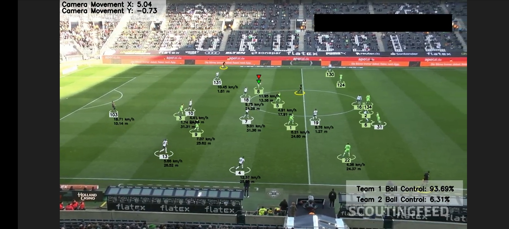
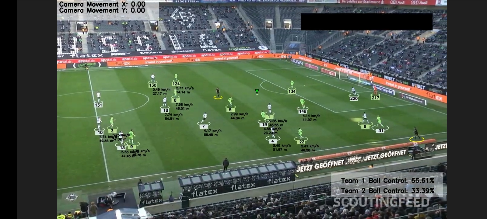

# ⚽ Football Analytics with Computer Vision

## 📸 Screenshots
### Screenshot 1

*Description: A snapshot of the system detecting and tracking players on the field.*

### Screenshot 2

*Description: Visualization of player segmentation and speed/distance calculations.*

## 📖 Overview
Football Analytics with Computer Vision is an advanced project designed to revolutionize football match analysis. By leveraging cutting-edge computer vision techniques and powerful machine learning algorithms, this system provides detailed insights into player movements, game dynamics, and performance metrics. The project utilizes technologies such as YOLO for object detection, KMeans for player segmentation, Optical Flow for camera movement estimation, OpenCV for computer vision tasks, and Pytorch for deep learning.

## 🌟 Features
- **🔍 Object Detection and Tracking**: Utilizes YOLO (You Only Look Once) for real-time detection and tracking of players and the ball throughout the match. This enables the system to gather accurate data on player positions and movements.
- **👥 Player Segmentation**: Implements KMeans clustering to segment and distinguish players on the field based on their locations and movements. This helps in identifying individual player actions and interactions.
- **🎥 Camera Movement Estimation**: Employs Optical Flow algorithms to estimate camera movements and compensate for them. This ensures that the analysis remains stable and consistent even when the camera is panning or zooming.
- **📏 Distance Measurement**: Applies perspective transformation techniques to convert 2D images into a 3D view, allowing for accurate measurement of distances on the field.
- **📊 Performance Analysis**: Calculates key performance metrics such as player speed, distance covered, and movement patterns. These insights can be used to improve player performance and develop better game strategies.

## 📂 Repository Structure
The repository is organized into the following folders, each containing an `__init__.py` file and relevant scripts:

1. **📂 camera_movement_estimator**: Contains scripts for estimating camera movements using Optical Flow.
2. **📂 development_and_analysis**: Includes development notes, analysis scripts, and documentation of the project’s progress and findings.
3. **📂 output_videos**: Directory to store processed output videos showcasing the analysis results.
4. **📂 player_ball_assigner**: Scripts for assigning the ball to players based on proximity and movement patterns.
5. **📂 speed_and_distance_estimator**: Contains scripts for estimating the speed and distance covered by players during the match.
6. **📂 stubs**: Placeholder files for various functionalities that are planned to be implemented.
7. **📂 team_assigner**: Scripts for assigning players to their respective teams using jersey colors and positions.
8. **📂 trackers**: Includes tracking algorithms to follow player and ball movements frame by frame.
9. **📂 training**: Training scripts and models used to train the object detection and segmentation algorithms.
10. **📂 utils**: Utility scripts for common tasks such as data preprocessing, visualization, and more.
11. **📂 view_transformer**: Scripts for perspective transformation to convert 2D images into a 3D view for accurate distance measurements.

## 📝 Main Script
- **main.py**: The primary script that orchestrates the entire analysis process. Run this script to start the analysis on your input video.

## 🚀 Getting Started
### 📋 Prerequisites
Before you begin, ensure you have met the following requirements:
- 🐍 Python 3.x
- 🔥 Pytorch
- 👁️ OpenCV
- 🦓 YOLO
- 📐 NumPy
- 🧪 Scikit-learn

### 📦 Installation
1. **Clone the repository**:
    ```sh
    git clone https://github.com/Prixis10/Football-Analytics-with-Computer-Vision.git
    cd Football-Analytics-with-Computer-Vision
    ```
2. **Install the required dependencies**:
    ```sh
    pip install -r requirements.txt
    ```

### ▶️ Usage
1. **Prepare your input video**: Place your video file in the `input_videos` folder.
2. **Run the analysis**: Execute the main script with your input video and specify the output path.
    ```sh
    python main.py --input input_videos/your_video.mp4 --output output_videos/processed_video.mp4
    ```

## 📹 Input and Output Videos
- **📥 Input Video**: [Link to Input Video](https://drive.google.com/file/d/1-cEE9hbM-ajVTN38a7WhG2Ti3uXF1SFt/view?usp=sharing)
- **📤 Output Video**: [Link to Output Video](https://drive.google.com/file/d/1ZEKLxGLb5k6NiqFbBH-IT0oGP_3nJy-k/view?usp=sharing)

## 🤝 Contribution
We welcome contributions from the community! If you have suggestions, find any issues, or would like to contribute, please fork the repository, submit issues, and send pull requests. For major changes, please open an issue first to discuss your ideas.

## 📧 Contact
For any inquiries or further information, please contact:
- **Pramit Roy**
  - **📧 Email**: prxmit.roy@gmail.com
  - **💼 LinkedIn**: [Pramit Roy](https://linkedin.com/in/prxmit)
  - **🐙 GitHub**: [Prixis10](https://github.com/Prixis10)

---

Thank you for checking out the Football Analytics with Computer Vision project! Your contributions and feedback are greatly appreciated.
